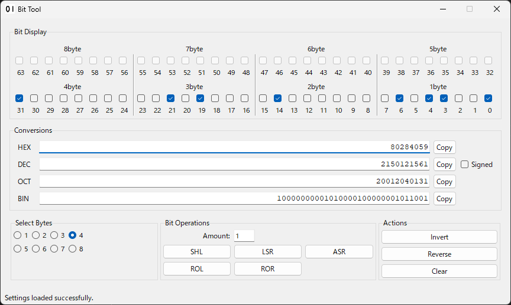

# Bit Tool

## Overview
  

Bit Tool is a desktop application designed to visualize and manipulate bits.  
It provides a user-friendly interface for observing the binary representation of numbers and performing various bit operations.  
This tool is useful when working with low-level data representations where bit patterns need to be understood and debugged.

## Main Features

*   **Multi-Format Display:** View numerical values in Hexadecimal, Decimal (with a toggle for signed/unsigned representation), Octal, and Binary formats simultaneously.
*   **Interactive Bit Grid:** A comprehensive 64-bit grid where each bit can be individually toggled using checkboxes. The display dynamically updates to reflect changes.
*   **Selectable Byte Size:** Users can select the active number of bytes (from 1 to 8 bytes) to work with, and the tool will mask operations and displays accordingly.
*   **Bitwise Operations:**
    *   **SHL (Shift Left):** Logical left shift.
    *   **LSR (Logical Shift Right):** Logical right shift (fills with zeros).
    *   **ASR (Arithmetic Shift Right):** Arithmetic right shift (preserves the sign bit).
    *   **ROL (Rotate Left):** Rotate bits to the left.
    *   **ROR (Rotate Right):** Rotate bits to the right.
*   **Value Manipulation:**
    *   **Invert:** Flip all bits within the selected byte range.
    *   **Reverse:** Reverse the order of bits within the selected byte range.
    *   **Clear:** Reset the current value to zero.

## How to Run

1.  Ensure you have Python installed on your system.
2.  Navigate to the project directory in your terminal.
3.  Run the application using the command: `python main.pyw`
